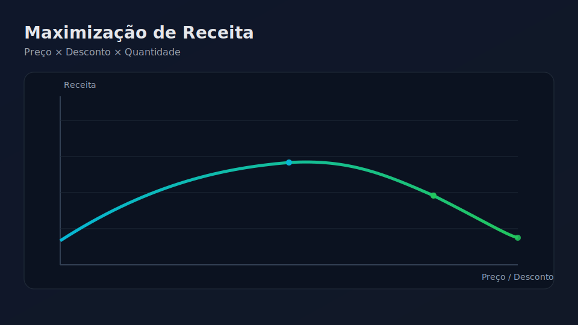

# Otimização de Receita com Machine Learning

[](https://github.com/flaviohenriquehb777/Projeto_Maximizacao_Receita/actions/workflows/ci.yml)
[](https://github.com/flaviohenriquehb777/Projeto_Maximizacao_Receita/deployments/activity_log?environment=github-pages)

Clique na miniatura para abrir a aplicação:

<p align="center">
  <a href="https://flaviohenriquehb777.github.io/Projeto_Maximizacao_Receita/" title="Abrir aplicação">
    
  </a>
  
</p>

[](LICENSE.md)

**Projeto de análise de dados de vendas e modelagem preditiva para otimização da receita, identificando a combinação ideal de preço de venda e desconto para maximizar lucros.**

## Sumário
- [Visão Geral do Projeto](#visão-geral-do-projeto)
- [Objetivos](#objetivos)
- [Estrutura do Projeto](#estrutura-do-projeto)
- [Base de Dados](#base-de-dados)
- [Metodologia de Análise e Modelagem](#metodologia-de-análise-e-modelagem)
- [Resultados Chave e Recomendações](#resultados-chave-e-recomendações)
- [Tecnologias Utilizadas](#tecnologias-utilizadas)
- [Instalação e Uso](#instalação-e-uso)
- [Licença](#licença)
- [Contato](#contato)

## Visão Geral do Projeto:

Este projeto foca na aplicação de Machine Learning (Regressão Linear) para analisar dados de vendas e determinar as estratégias ideais de precificação e desconto que maximizem a receita. Através de uma análise exploratória detalhada e da construção de um modelo preditivo, buscamos fornecer insights acionáveis para otimização do desempenho de vendas.

## Objetivos:

* Realizar uma análise exploratória completa da base de dados de vendas.
* Entender a relação entre 'PrecoVenda', 'PrecoOriginal', 'Desconto' e 'VendaQtd'.
* Construir e avaliar um modelo de regressão capaz de prever a quantidade vendida.
* Identificar a combinação ideal de preço de venda e desconto para maximizar a receita.

## Estrutura do Projeto

- `dados/`: bases originais utilizadas nos estudos (não são necessárias para rodar a aplicação web; o treino usa `dataset_cafeterias_rj.xlsx`).
  - `dataset_cafeterias_rj.xlsx`
  - `dadosVenda.xlsx`
- `notebooks/`: cadernos Jupyter (EDA e estudos); não são obrigatórios para uso da aplicação.
  - `Projeto_Maximizacao_Receita_01.ipynb`
  - `Projeto_Maximizacao_Receita_EDA_Preprocess.ipynb`
  - `Projeto_Maximizacao_Receita_Final.ipynb`
- `src/`: código-fonte
  - `config/paths.py`: caminhos e constantes
  - `modeling/train_pipeline.py`: pipeline de treino, validação e geração de artefatos
  - `modeling/train_linear.py`: treino simples (compatível, mas o pipeline é preferível)
- `models/`: artefatos gerados pelo treino (ex.: `best_model_max_receita.pkl`, `curve_business_metric.csv`, `model_linear.json`, `shap_summary.png`)
- `docs/`: site estático consumindo `model_linear.json` e `curve_business_metric.csv`
  - `index.html`
  - `model_linear.json`
  - `curve_business_metric.csv`
- `.github/workflows/ci.yml`: CI para instalar, testar, treinar e publicar `docs/`
- `tests/`: testes unitários/integrados
- `requirements.txt`, `README.md`, `LICENSE.md`

## Base de Dados:

O projeto utiliza o arquivo `dataset_cafeterias_rj.xlsx` (constante `DADOS_AMOR_A_CAKES`), localizado na pasta `dados/`. Este dataset inclui as seguintes colunas principais:

* `preco_final`: Preço final de venda do produto.
* `preco_original`: Preço original do produto antes de qualquer desconto.
* `desconto_pct`: Desconto aplicado ao produto (0–0.04).
* `quantidade_vendida_dia` e `quantidade_vendida_mes`: Quantidades vendidas.

Com base nos testes de normalidade (Shapiro) e homogeneidade de variâncias (Levene), optamos por **não normalizar** (sem scaler) para a Regressão Linear e tratamos outliers com **winsorização por IQR** nas variáveis numéricas.

## Metodologia de Análise e Modelagem:

O desenvolvimento do projeto seguiu as seguintes etapas:

1.  **Carregamento e Inspeção de Dados:** Inicialização e compreensão da estrutura da base de dados.
2.  **Análise Exploratória de Dados (EDA):** Identificação de padrões, tendências e anomalias nas relações entre preço, desconto e quantidade vendida.
3.  **Pré-processamento:**
    * Tratamento de valores ausentes (se houver).
    * Escalonamento das variáveis numéricas para padronização.
    * Divisão dos dados em conjuntos de treino e teste.
4.  **Modelagem Preditiva:**
    * Avaliação de diversos algoritmos de regressão para prever a `VendaQtd`.
    * A **Regressão Linear** foi selecionada devido ao seu bom ajuste e interpretabilidade.
    * Utilização de *pipelines* do scikit-learn para encapsular etapas de pré-processamento e modelagem.
5.  **Avaliação do Modelo:**
    * Métricas como RMSE (Root Mean Squared Error) e R² (Coeficiente de Determinação) foram utilizadas para avaliar a performance do modelo.
    * Análise da curva de aprendizagem para verificar *underfitting* ou *overfitting*.
6.  **Otimização de Receita:**
    * A aplicação web varre descontos entre 0% e 4% (resolução configurável), calcula `preco_final = preco_original * (1 - desconto)` e prevê `quantidade_vendida`. Em seguida, maximiza `receita = preco_final * quantidade_vendida`.

## Resultados Chave e Recomendações:

Os resultados dependem dos coeficientes reais treinados no seu ambiente. A aplicação exibirá o desconto ideal, o preço final e a receita estimada com base no **modelo exportado**. Recomenda-se reavaliar periodicamente e monitorar a elasticidade de demanda em campanhas reais.

## Tecnologias Utilizadas:

* **Python:** Linguagem de programação principal.
* **Pandas:** Para manipulação e análise de dados tabulares.
* **NumPy:** Para operações numéricas de alto desempenho.
* **Scikit-learn (sklearn):** Para pré-processamento e modelagem (LinearRegression, Pipeline), divisão de dados (train_test_split) e avaliação de modelos (RMSE, MAE, R²).
* **Matplotlib:** Para criação de gráficos, especialmente a curva de aprendizagem.
* **Seaborn:** Para visualizações estatísticas e aprimoramento estético dos gráficos.
* **XGBoost:** Como candidato não linear com restrições monotônicas e regularização.
* **ONNX + skl2onnx/onnxmltools:** Exportação do Best Model para uso estático no navegador.
* **onnxruntime-web:** Execução do modelo ONNX diretamente no browser.

## Instalação e Uso

Para configurar e executar este projeto em seu ambiente local, siga as instruções abaixo:

1. **Pré-requisitos**
   - Python 3.12 (recomendado; CI usa 3.12)
   - `pip`
   - (Opcional) Jupyter Lab para explorar os notebooks

2.  **Clone o repositório:**
    ```bash
    git clone [https://github.com/seu-usuario/Projeto_Maximizacao_Receita.git](https://github.com/seu-usuario/Projeto_Maximizacao_Receita.git)
    cd Projeto_Maximizacao_Receita
    ```
    *(Lembre-se de substituir `seu-usuario` pelo seu nome de usuário do GitHub.)*

3. **Instale as dependências**
    ```bash
    pip install -r requirements.txt
    ```

4. **(Opcional) Acesse e execute os notebooks**
    ```bash
    jupyter lab
    ```
    * Navegue até `notebooks/` e abra: `Projeto_Maximizacao_Receita_01.ipynb` → `Projeto_Maximizacao_Receita_EDA_Preprocess.ipynb`.

5. **Execute os testes e o pipeline de treino**
   ```bash
   # Defina PYTHONPATH para permitir imports dos testes
   export PYTHONPATH=$(pwd)   # Linux/macOS
   # No Windows PowerShell: $env:PYTHONPATH = (Get-Location).Path

   pytest -q
   python -m src.modeling.train_pipeline
   ```
   - Artefatos gerados em `models/`: `best_model_max_receita.pkl`, `model_best.onnx`, `model_best_meta.json`, `curve_business_metric.csv`, `model_linear.json`, `shap_summary.png`.
   - O pipeline publica automaticamente em `docs/`: `model_best.onnx`, `model_best_meta.json`, `curve_business_metric.csv`, além de manter `model_linear.json` para compatibilidade.

6. **Suba o site estático localmente**
   ```bash
   python -m http.server 8000
   # Abra http://localhost:8000/docs/
   ```

## Boas práticas e versão de arquivos

- Artefatos pesados e dados brutos não são versionados (ver `.gitignore`).
- Os notebooks são materiais de apoio; a aplicação e a CI usam o código em `src/`.
- A CI
  - Instala dependências
  - Executa `pytest` com `PYTHONPATH`
  - Treina com `python -m src.modeling.train_pipeline`
  - Copia artefatos para `docs/` e publica GitHub Pages

## Modelo na página vs Best Model

- A aplicação web em `docs/index.html` utiliza `docs/model_linear.json` para prever quantidade e calcular receita/lucro no gráfico de previsão linear.
- O pipeline seleciona o **Best Model** por lucro esperado em validação (ex.: `GradientBoosting`). Esse modelo é salvo em `models/best_model_max_receita.pkl` e seus artefatos (curva de negócio, métricas) são registrados.
 - A página agora suporta três visualizações:
   - `Gráfico de previsão linear`: usa o JSON linear para varrer descontos e calcular receita/lucro previstos.
   - `Previsão BEST (ONNX)`: usa o modelo não linear exportado em ONNX (`docs/model_best.onnx`) rodando no navegador com `onnxruntime-web`.
   - `Curva de referência`: usa `docs/curve_business_metric.csv`, gerada no treino, para visualizar as médias de receita/lucro do dataset.
 - Publicação dos artefatos para a página:
   - Após `python -m src.modeling.train_pipeline`, os arquivos são gerados em `models/` e também publicados em `docs/`:
     - `docs/model_linear.json` (baseline linear para compatibilidade)
     - `docs/model_best.onnx` e `docs/model_best_meta.json` (ordem das features) para a visualização BEST
     - `docs/curve_business_metric.csv` (curva média de negócio)
 - Dependências adicionadas para exportação e execução do ONNX: `onnx`, `skl2onnx`, `onnxmltools`. No front-end, o `index.html` importa `onnxruntime-web` via CDN.
 - Melhorias no XGBoost: passamos a usar restrições monotônicas alinhadas ao domínio (`custo_producao`, `preco_original` e `preco_final` com efeito negativo; `desconto_pct` com efeito positivo), regularização (`reg_lambda`, `min_child_weight`), e configuração de busca com `tree_method='hist'`. Isso ajuda a manter previsões consistentes e estáveis para a maximização de receita/lucro.
 - Observação: a escolha do Best Model (tipicamente não linear, como `GradientBoosting` ou `XGBoost`) impacta as curvas e o ponto ótimo. A execução ONNX no navegador permite previsões fiéis sem servidor, mantendo uma experiência profissional e estática.

## Política de datas de commits (Jan–Jun/2022)

- Todos os commits do projeto devem ter datas entre `2022-01-01` e `2022-06-30`.
- O pipeline possui um guard no CI que falha caso algum commit esteja fora desse intervalo.
- Para facilitar no Windows/PowerShell:
  - Novo commit com mensagem e data fixa:
    - `powershell -ExecutionPolicy Bypass -File scripts/commit_2022.ps1 -Message "sua mensagem" -DateISO "2022-06-30T12:00:00Z"`
  - Emendar o último commit mantendo a mensagem:
    - `powershell -ExecutionPolicy Bypass -File scripts/commit_2022.ps1 -DateISO "2022-06-30T12:00:00Z"`

Observação: o script aplica clamp automático se a data fornecida estiver fora do intervalo permitido.

## Integração com DagsHub (MLflow)

Com credenciais configuradas (secrets), os treinos podem ser registrados no DagsHub via MLflow. Configure:

- `MLFLOW_EXPERIMENT_NAME`: nome do experimento
- `MLFLOW_TRACKING_URI`, `MLFLOW_TRACKING_USERNAME`, `MLFLOW_TRACKING_PASSWORD` ou token

Em seguida, habilite no pipeline (ou CI) o log de parâmetros, métricas e artefatos (best model e explicabilidade). Caso os secrets não estejam configurados, o pipeline segue com tracking local sem falhar.

## Licença:

Este projeto está licenciado sob a Licença MIT. Para mais detalhes, consulte o arquivo [LICENSE.md](LICENSE.md) na raiz do repositório.

## Contato:

Se tiver alguma dúvida, sugestão ou quiser colaborar, sinta-se à vontade para entrar em contato:
-   **Nome:** Flávio Henrique Barbosa
-   **LinkedIn:** [Flávio Henrique Barbosa | LinkedIn](https://www.linkedin.com/in/fl%C3%A1vio-henrique-barbosa-38465938)
-   **Email:** flaviohenriquehb777@outlook.com